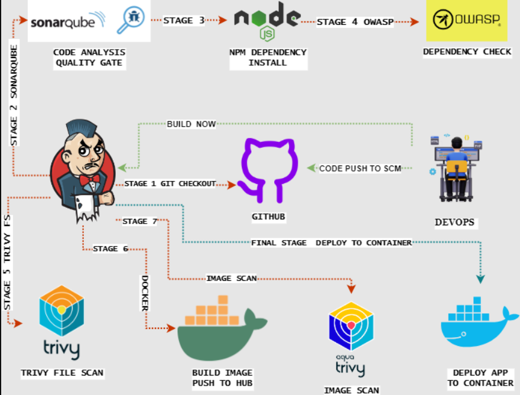
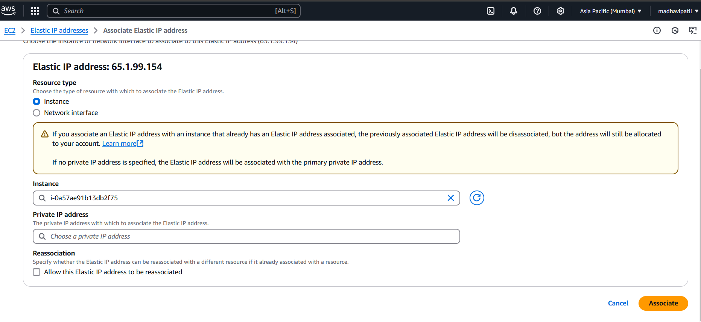
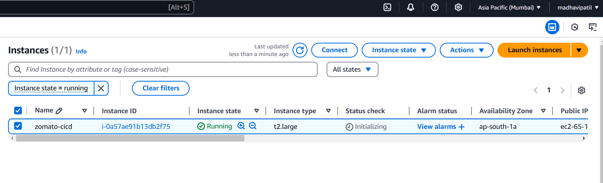
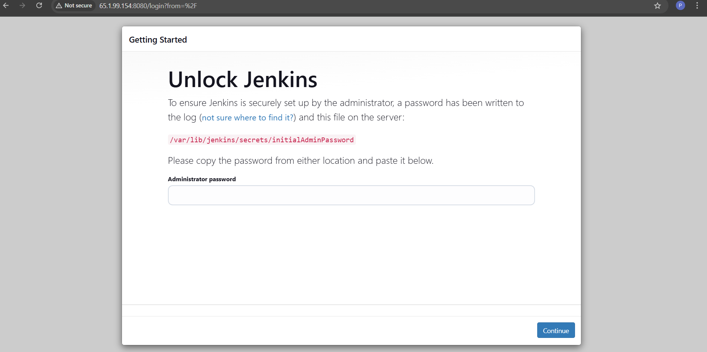
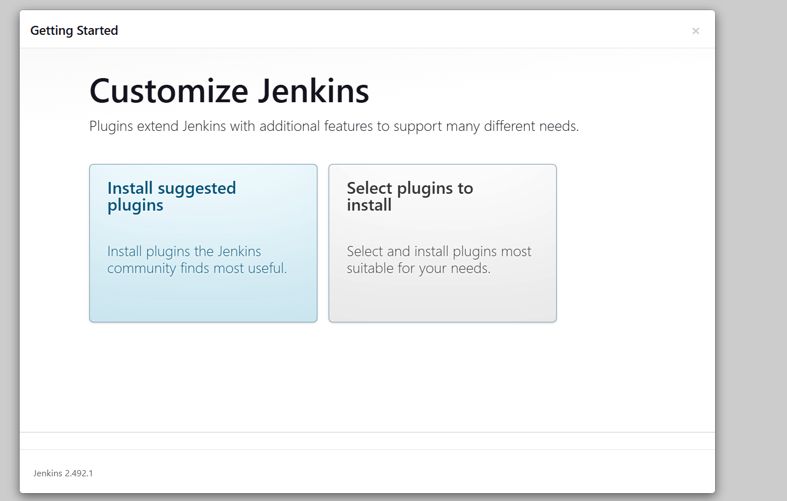
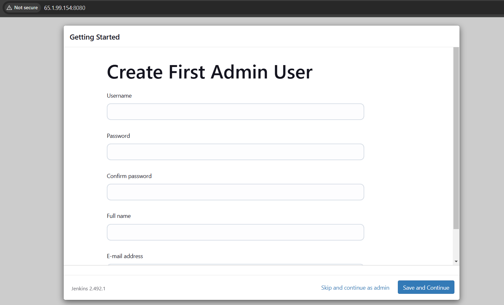

## Zomato Clone App with DevSecOps CI/CD

Deploying a React Js Zomato-clone Application. We will be using `Jenkins` as a CICD tool and deploying our application on a `Docker container` and push it in a `Docker-Hub`. I Hope this detailed readme file will be useful.

---

### DevSecOps  CICD Project flow :

  

  [FOR DETAILED BLOD CLICK HERE](https://mrcloudbook.com/zomato-clone-app-with-devsecops-ci-cd/)
  

---

**prerequisites**

  - Account of Aws/azure clud
  - Jenkins Installed
  - Account on Dockerhub
  - Docker installed

---

 ## **Step 1. Launch an Ubuntu 22.04 EC2 Instance with size `t2.large`machine** 
   1. You can attached an Elastic Ip address so that if you stopped your machine you can get an same ip address but look into an cost optimization in aws or azure .
   2. Here I am using an Aws cloud.

   3. I have attched an Elastic-ip to my instance.

## ***steps for elastic ip***

### 🔹 **Step 1: Allocate an Elastic IP**
1. Sign in to the **AWS Management Console**.
2. Navigate to **EC2 Dashboard**.
3. In the left panel, click **Elastic IPs** under **Network & Security**.
4. Click **Allocate Elastic IP address**.
5. Select **Amazon’s pool of IPv4 addresses** and click **Allocate**.
6. Copy the allocated **Elastic IP** for later use.

### 🔹 **Step 2: Associate the Elastic IP with an EC2 Instance**
1. Go to **Elastic IPs** in the EC2 Dashboard.
2. Select the allocated IP and click **Actions > Associate Elastic IP address**.
3. In the **Instance field**, select the EC2 instance to associate the IP with.
4. Choose the **private IP address** (if multiple exist).
5. Click **Associate**.



 ✅ **Your EC2 instance is now associated with the Elastic IP.**  
    

Now logged in into the machine via `SSH`.

---
## Step 2. Install Jenkins Docker Sonarqube and Trivy
 1. Install Jdk-17 on your machine for jenkins
    ```bash
    sudo apt update && sudo apt install -y openjdk-17-jdk

    ```
 2. To Install Jenkins in linux Go to [Long Term support](https://www.jenkins.io/doc/book/installing/linux/#debianubuntu)

 3. Once Jenkins is installed, you will need to go to your Web Browser and type your public-ip address along with port 8080, since Jenkins works on Port 8080.
 
 4. Now, grab your Public IP Address
```bash
   EC2 Public IP Address:8080
   sudo cat /var/lib/jenkins/secrets/initialAdminPassword
```
 5. Jenkins is instelld Succefully,and You will see the follwing page



 6. Unlock Jenkins using an administrative password and install the suggested plugins.
  `sudo cat /var/lib/jenkins/secrets/initialAdminPassword`

 7. Jenkins will now get installed and install all the libraries.

 

 8. Create a user click on save and continue.

 

 9. Jenkins Getting Started Screen.


 

