## Zomato Clone App with DevSecOps CI/CD

Deploying a React Js Zomato-clone Application. We will be using `Jenkins` as a CICD tool and deploying our application on a `Docker container` and push it in a `Docker-Hub`. I Hope this detailed readme file will be useful.

---

### DevSecOps  CICD Project flow :

  

  [FOR DETAILED BLOD CLICK HERE](https://mrcloudbook.com/zomato-clone-app-with-devsecops-ci-cd/)
  

---

**prerequisites**

  - Account of Aws/azure clud
  - Jenkins Installed
  - Account on Dockerhub
  - Docker installed

---

 ## **Step 1. Launch an Ubuntu 22.04 EC2 Instance with size `t2.large`machine** 
   1. You can attached an Elastic Ip address so that if you stopped your machine you can get an same ip address but look into an cost optimization in aws or azure .
   2. Here I am using an Aws cloud.

   3. I have attched an Elastic-ip to my instance.

## ***steps for elastic ip***

### 🔹 **Step 1: Allocate an Elastic IP**
1. Sign in to the **AWS Management Console**.
2. Navigate to **EC2 Dashboard**.
3. In the left panel, click **Elastic IPs** under **Network & Security**.
4. Click **Allocate Elastic IP address**.
5. Select **Amazon’s pool of IPv4 addresses** and click **Allocate**.
6. Copy the allocated **Elastic IP** for later use.

### 🔹 **Step 2: Associate the Elastic IP with an EC2 Instance**
1. Go to **Elastic IPs** in the EC2 Dashboard.
2. Select the allocated IP and click **Actions > Associate Elastic IP address**.
3. In the **Instance field**, select the EC2 instance to associate the IP with.
4. Choose the **private IP address** (if multiple exist).
5. Click **Associate**.


 ✅ **Your EC2 instance is now associated with the Elastic IP.**  
    

Now logged in into the machine via `SSH`.

---
## Step 2. Install Jenkins Docker Sonarqube and Trivy

 ### Installing Jenkins 
 1. Install Jdk-17 on your machine for jenkins
    ```bash
    sudo apt update && sudo apt install -y openjdk-17-jdk

    ```
 2. To Install Jenkins in linux Go to [Long Term support](https://www.jenkins.io/doc/book/installing/linux/#debianubuntu)

 3. Once Jenkins is installed, you will need to go to your Web Browser and type your public-ip address along with port 8080, since Jenkins works on Port 8080.
 
 4. Now, grab your Public IP Address
```bash
   EC2 Public IP Address:8080
   sudo cat /var/lib/jenkins/secrets/initialAdminPassword
```
 5. Jenkins is instelld Succefully,and You will see the follwing page


 6. Unlock Jenkins using an administrative password and install the suggested plugins.
  `sudo cat /var/lib/jenkins/secrets/initialAdminPassword`

 7. Jenkins will now get installed and install all the libraries.

 

 8. Create a user click on save and continue.

 

 9. Jenkins Getting Started Screen.

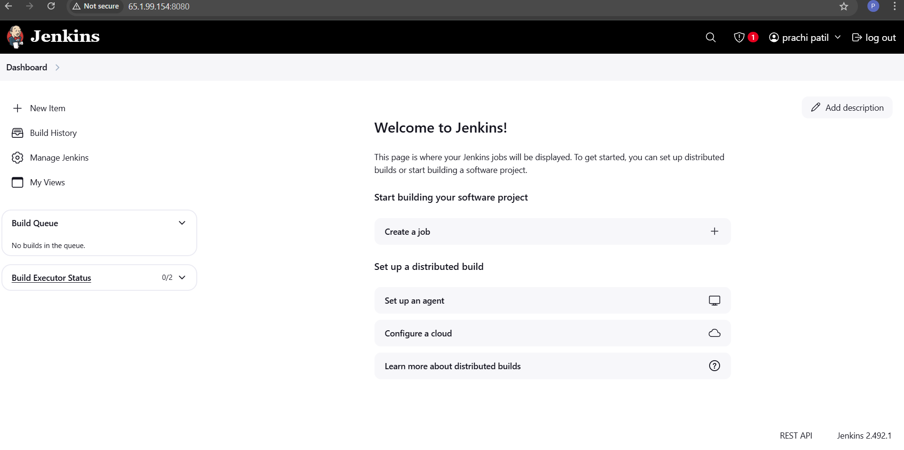

### Installing Docker 
```bash
sudo apt-get update
sudo apt-get install docker.io -y
sudo usermod -aG docker $USER
newgrp docker
sudo chmod 777 /var/run/docker.sock
```
#### After the docker installation, we create a sonarqube container (Remember to add 9000 ports in the security group).

```sh
docker run -d --name sonar -p 9000:9000 sonarqube:lts-community
```
1. Now our sonarqube is up and Running. 

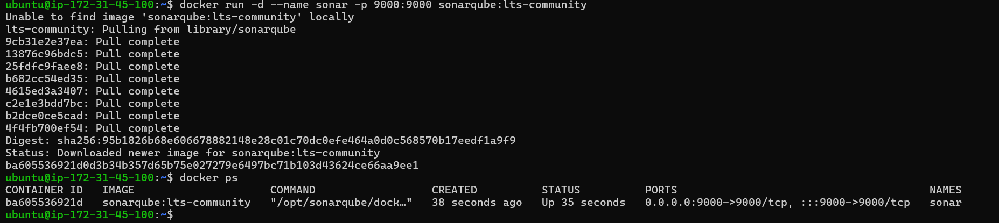


2. Enter username and password, click on login and change password
 ```bash
 username admin
 password admin
 ```
 
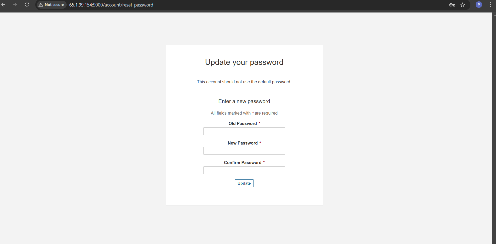

3. Update New password, This is Sonar Dashboard.

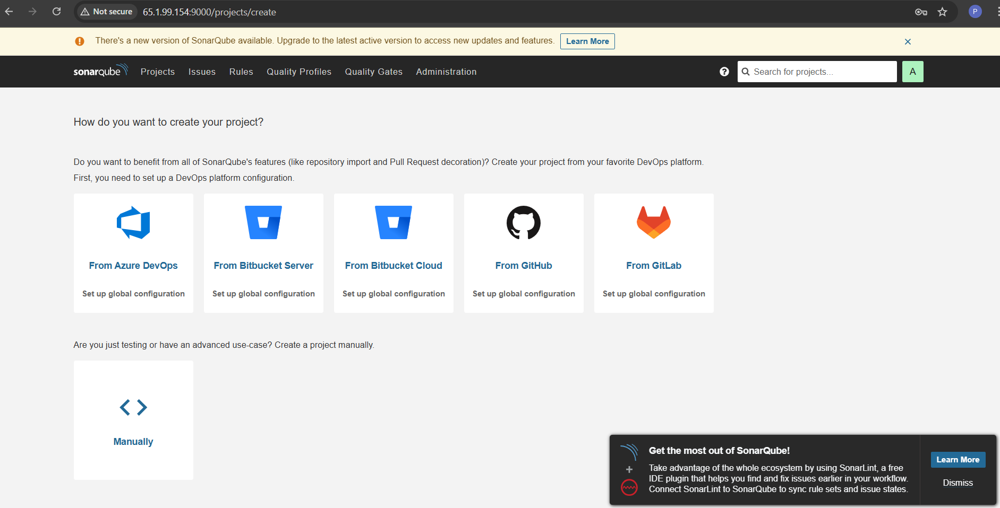


### Installing trivy

```bash
vi trivy.sh
```

```bash
sudo apt-get install wget apt-transport-https gnupg lsb-release -y
wget -qO - https://aquasecurity.github.io/trivy-repo/deb/public.key | gpg --dearmor | sudo tee /usr/share/keyrings/trivy.gpg > /dev/null
echo "deb [signed-by=/usr/share/keyrings/trivy.gpg] https://aquasecurity.github.io/trivy-repo/deb $(lsb_release -sc) main" | sudo tee -a /etc/apt/sources.list.d/trivy.list
sudo apt-get update
sudo apt-get install trivy -y
```
Run above script using `sh trivy.sh`


Next, we will log in to Jenkins and start to configure our Pipeline in Jenkins

---

## Step 3 : Install Plugins like JDK, Sonarqube Scanner, NodeJs, OWASP Dependency Check

## 🛠 3A — Install Plugin  

## 📌 Steps to Install Plugins in Jenkins  

1. Navigate to **Manage Jenkins** → **Plugins** → **Available Plugins**  
2. Install the following plugins **without restart**:  

   - **Eclipse Temurin Installer**  
   - **SonarQube Scanner**  
   - **NodeJs Plugin**  

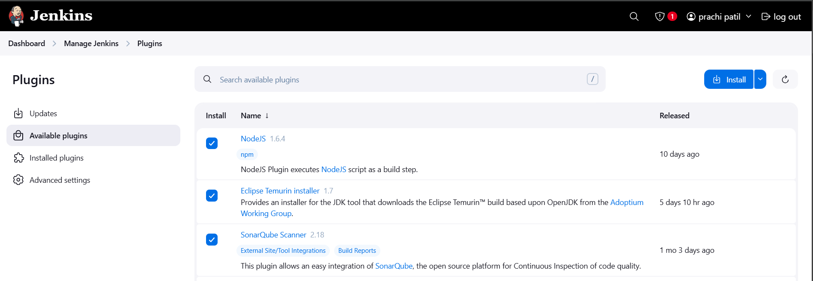


## 🛠 3B — Configure Java and Node.js in Global Tool Configuration  

### 📌 Steps to Configure Java (JDK 17) and Node.js (16)  

1. Navigate to **Manage Jenkins** → **Global Tool Configuration**  
2. Scroll down to **JDK** and **NodeJS** sections  
3. Configure the tools as follows:  
   - **JDK:** Install **JDK 17**  
   - **Node.js:** Install **Node.js 16**  
4. Click **Apply** and then **Save**  

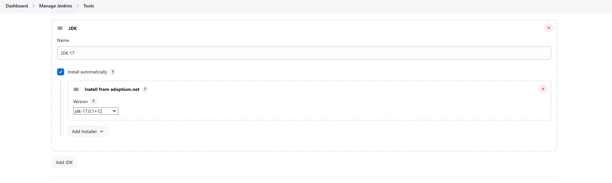


## 🛠 3C — Create a Job in Jenkins  

## 📌 Steps to Create a Pipeline Job  

1. Navigate to **Jenkins Dashboard**  
2. Click on **New Item**  
3. Enter the job name as **Zomato**  
4. Select **Pipeline** as the job type  
5. Click **OK**  
6. Configure the pipeline as needed  
7. Click **Apply** and then **Save**  

✅ The Jenkins pipeline job **Zomato** is now created. 

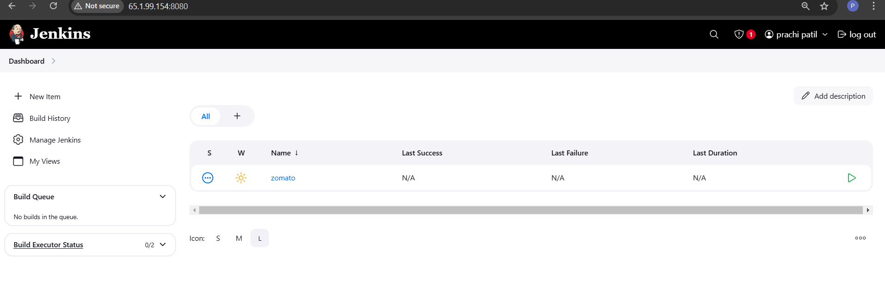

## 🛠 Step 4 — Configure Sonar Server in Manage Jenkins  

## 📌 Steps to Configure SonarQube Server  

1. **Get the Public IP Address** of your EC2 instance  
2. SonarQube runs on **Port 9000**, so access it using: 
 `http:<public-ip>:9000`

3. **Login to SonarQube Server**  
4. Navigate to:  
- **Administration** → **Security** → **Users**

 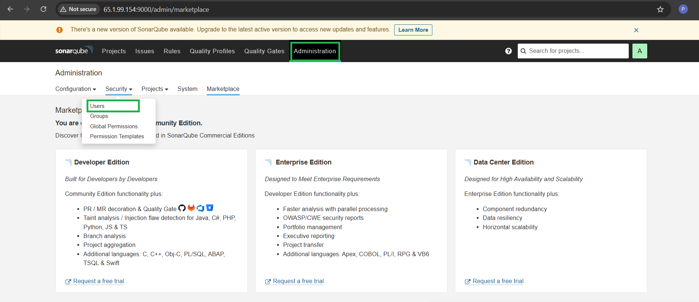  

- Click on **Tokens**  
5. Click on **Update Token**  

 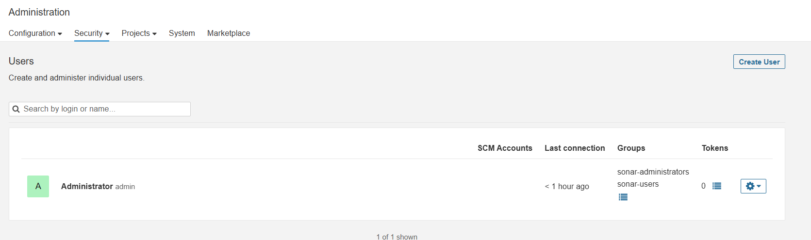

6. **Give it a name** and click on **Generate Token** 

7. Copy and store the token securely for Jenkins integration  

8. Goto Jenkins Dashboard → Manage Jenkins → Credentials → Add Secret Text.

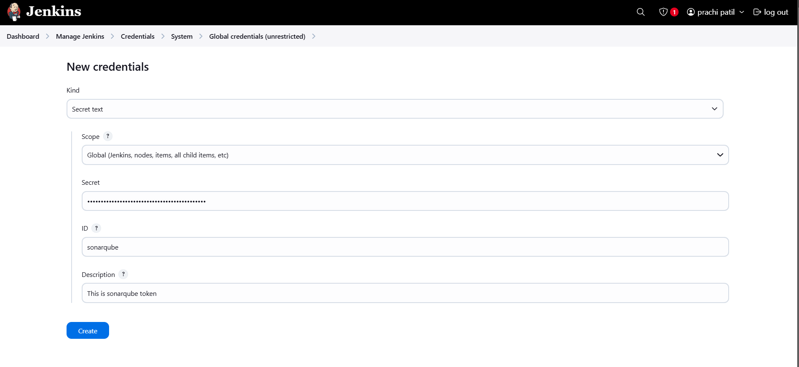

9. You will this page once you click on create

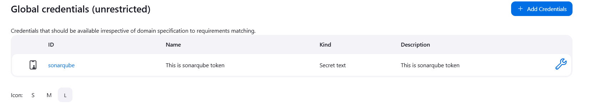

10. Now, go to Dashboard → Manage Jenkins → System and Add like the below image.

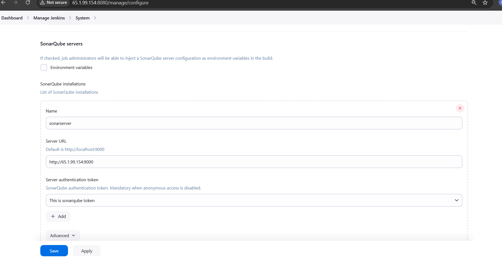

The Configure System option is used in Jenkins to configure different server

Global Tool Configuration is used to configure different tools that we install using Plugins

We will install a sonar scanner in the tools.
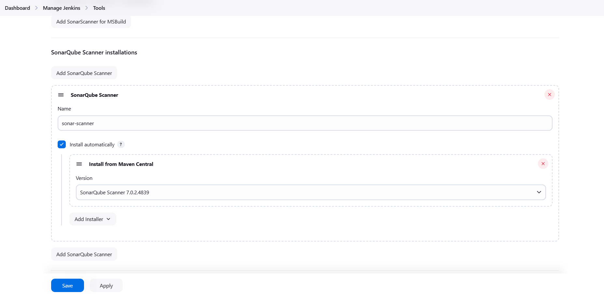


